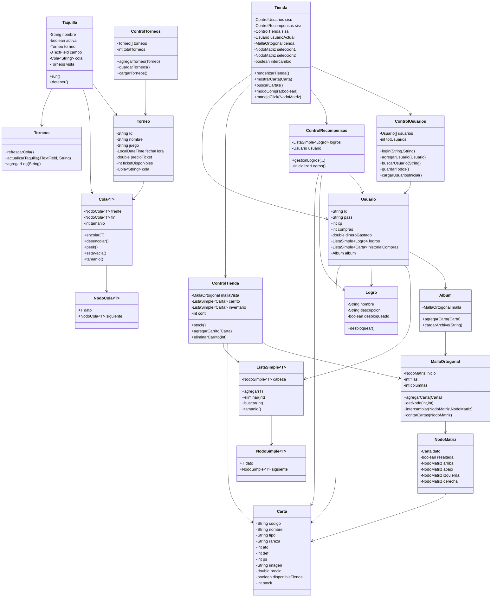

# Diagrama de Clases UML - GameZone Pro

```mermaid
classDiagram

%% =======================
%% VISTA
%% =======================
class Tienda {
    -ControlUsuarios sisu
    -ControlRecompensas sisr
    -ControlTienda sisa
    -Usuario usuarioActual
    -MallaOrtogonal tienda
    -NodoMatriz seleccion1
    -NodoMatriz seleccion2
    -boolean intercambio
    +renderizarTienda()
    +mostrarCarta(Carta)
    +buscarCartas()
    +modoCompra(boolean)
    +manejoClick(NodoMatriz)
}

class Torneos {
    +refrescarCola()
    +actualizarTaquilla(JTextField, String)
    +agregarLog(String)
}

class Taquilla {
    -String nombre
    -boolean activa
    -Torneo torneo
    -JTextField campo
    -Cola~String~ cola
    -Torneos vista
    +run()
    +detener()
}

%% =======================
%% MODELO
%% =======================
class Usuario {
    -String Id
    -String pass
    -int xp
    -int compras
    -double dineroGastado
    -ListaSimple~Logro~ logros
    -ListaSimple~Carta~ historialCompras
    -Album album
}

class Carta {
    -String codigo
    -String nombre
    -String tipo
    -String rareza
    -int atq
    -int def
    -int ps
    -String imagen
    -double precio
    -boolean disponibleTienda
    -int stock
}

class Logro {
    -String nombre
    -String descripcion
    -boolean desbloqueado
    +desbloquear()
}

class Torneo {
    -String Id
    -String nombre
    -String juego
    -LocalDateTime fechaHora
    -double precioTicket
    -int ticketDisponibles
    -Cola~String~ cola
}

class Album {
    -MallaOrtogonal malla
    +agregarCarta(Carta)
    +cargarArchivo(String)
}

%% =======================
%% ESTRUCTURAS
%% =======================
class Cola~T~ {
    -NodoCola~T~ frente
    -NodoCola~T~ fin
    -int tamanio
    +encolar(T)
    +desencolar()
    +peek()
    +estaVacia()
    +tamanio()
}

class NodoCola~T~ {
    +T dato
    +NodoCola~T~ siguiente
}

class ListaSimple~T~ {
    -NodoSimple~T~ cabeza
    +agregar(T)
    +eliminar(int)
    +buscar(int)
    +tamanio()
}

class NodoSimple~T~ {
    +T dato
    +NodoSimple~T~ siguiente
}

class MallaOrtogonal {
    -NodoMatriz inicio
    -int filas
    -int columnas
    +agregarCarta(Carta)
    +getNodo(int,int)
    +intercambiar(NodoMatriz,NodoMatriz)
    +contarCartas(NodoMatriz)
}

class NodoMatriz {
    -Carta dato
    -boolean resaltada
    -NodoMatriz arriba
    -NodoMatriz abajo
    -NodoMatriz izquierda
    -NodoMatriz derecha
}

%% =======================
%% CONTROLADORES
%% =======================
class ControlUsuarios {
    -Usuario[] usuarios
    -int totUsuarios
    +login(String,String)
    +agregarUsuario(Usuario)
    +buscarUsuario(String)
    +guardarTodos()
    +cargarUsuariosInicial()
}

class ControlRecompensas {
    -ListaSimple~Logro~ logros
    -Usuario usuario
    +gestionLogros(...)
    +inicializarLogros()
}

class ControlTienda {
    -MallaOrtogonal mallaVista
    -ListaSimple~Carta~ carrito
    -ListaSimple~Carta~ inventario
    -int cont
    +stock()
    +agregarCarrito(Carta)
    +eliminarCarrito(int)
}

class ControlTorneos {
    -Torneo[] torneos
    -int totalTorneos
    +agregarTorneo(Torneo)
    +guardarTorneos()
    +cargarTorneos()
}

%% =======================
%% RELACIONES
%% =======================

Usuario --> Album
Usuario --> ListaSimple
Usuario --> Logro
Usuario --> Carta

Album --> MallaOrtogonal
MallaOrtogonal --> NodoMatriz
NodoMatriz --> Carta

ControlUsuarios --> Usuario
ControlRecompensas --> Usuario
ControlRecompensas --> Logro
ControlRecompensas --> Carta

ControlTienda --> MallaOrtogonal
ControlTienda --> Carta
ControlTienda --> ListaSimple

ControlTorneos --> Torneo
Torneo --> Cola

Cola --> NodoCola
ListaSimple --> NodoSimple

Taquilla --> Torneo
Taquilla --> Cola
Taquilla --> Torneos

Tienda --> ControlUsuarios
Tienda --> ControlRecompensas
Tienda --> ControlTienda
Tienda --> Usuario
```
