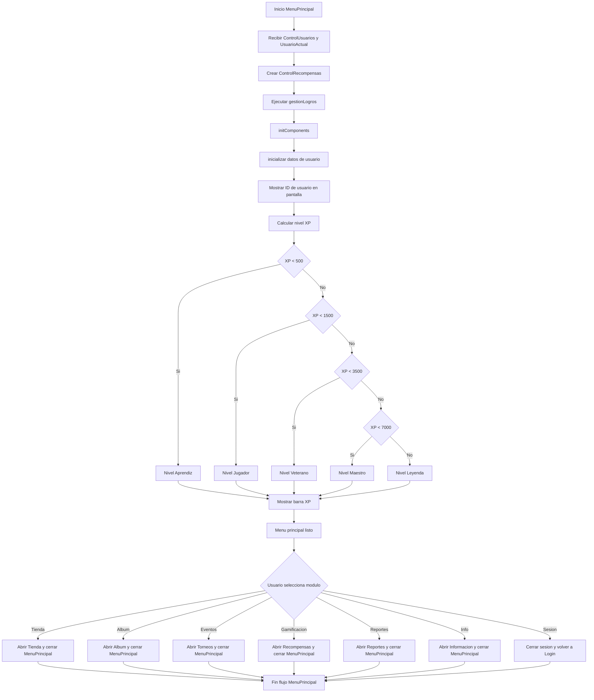
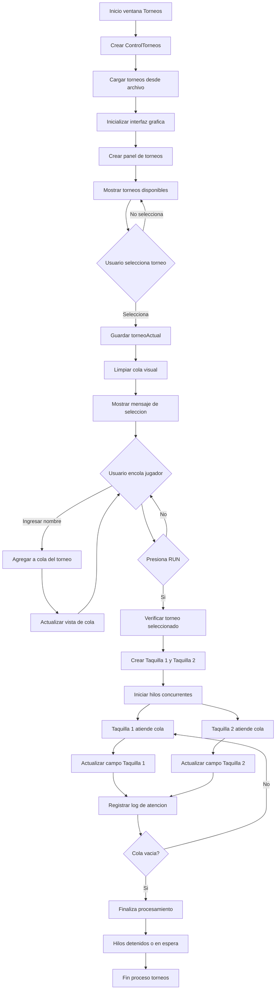
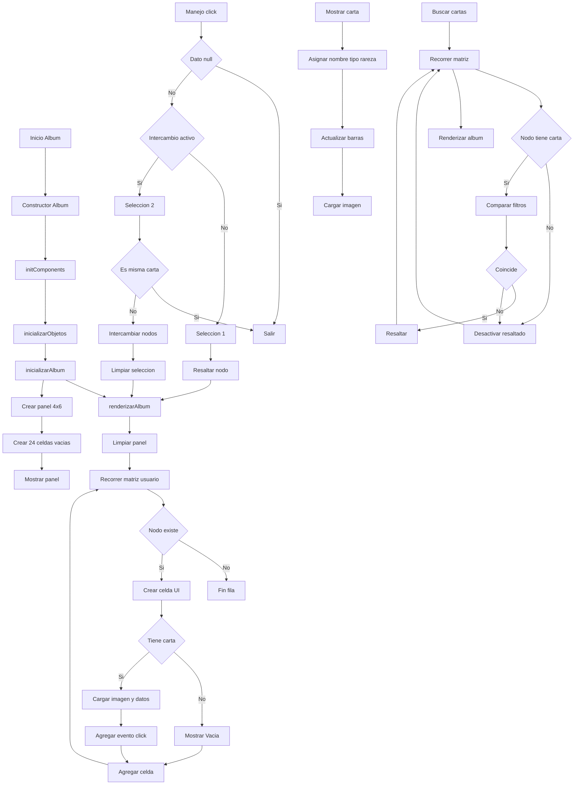
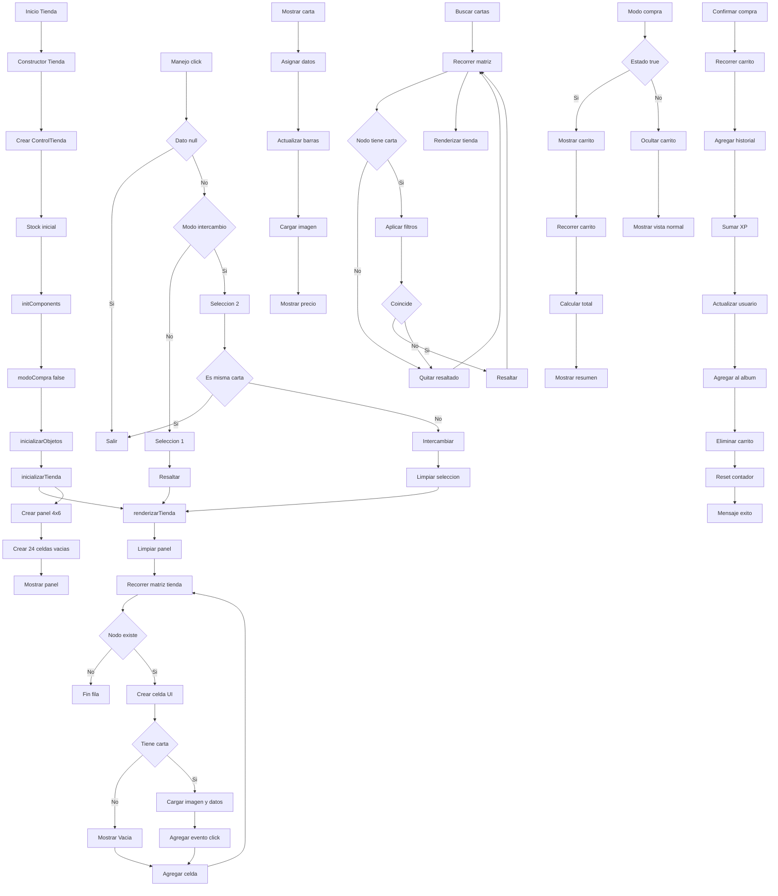

# Diagrama de Flujo de GameZone Pro

---

## Menú principal

```mermaid
flowchart TD
    A[Inicio MenuPrincipal] --> B[Recibir ControlUsuarios y UsuarioActual]
    B --> C[Crear ControlRecompensas]
    C --> D[Ejecutar gestionLogros]

    D --> E[initComponents]
    E --> F[inicializar datos de usuario]

    F --> G[Mostrar ID de usuario en pantalla]

    G --> H[Calcular nivel XP]

    H --> I{XP < 500}
    I -->|Si| J[Nivel Aprendiz]
    I -->|No| K{XP < 1500}

    K -->|Si| L[Nivel Jugador]
    K -->|No| M{XP < 3500}

    M -->|Si| N[Nivel Veterano]
    M -->|No| O{XP < 7000}

    O -->|Si| P[Nivel Maestro]
    O -->|No| Q[Nivel Leyenda]

    J --> R[Mostrar barra XP]
    L --> R
    N --> R
    P --> R
    Q --> R

    R --> S[Menu principal listo]

    S --> T{Usuario selecciona modulo}

    T -->|Tienda| U[Abrir Tienda y cerrar MenuPrincipal]
    T -->|Album| V[Abrir Album y cerrar MenuPrincipal]
    T -->|Eventos| W[Abrir Torneos y cerrar MenuPrincipal]
    T -->|Gamificacion| X[Abrir Recompensas y cerrar MenuPrincipal]
    T -->|Reportes| Y[Abrir Reportes y cerrar MenuPrincipal]
    T -->|Info| Z[Abrir Informacion y cerrar MenuPrincipal]
    T -->|Sesion| AA[Cerrar sesion y volver a Login]

    U --> END[Fin flujo MenuPrincipal]
    V --> END
    W --> END
    X --> END
    Y --> END
    Z --> END
    AA --> END
```

## Torneo

```mermaid
flowchart TD

A[Inicio ventana Torneos] --> B[Crear ControlTorneos]
B --> C[Cargar torneos desde archivo]
C --> D[Inicializar interfaz grafica]

D --> E[Crear panel de torneos]
E --> F[Mostrar torneos disponibles]

F --> G{Usuario selecciona torneo}

G -->|Selecciona| H[Guardar torneoActual]
H --> I[Limpiar cola visual]
I --> J[Mostrar mensaje de seleccion]

G -->|No selecciona| F

J --> K{Usuario encola jugador}

K -->|Ingresar nombre| L[Agregar a cola del torneo]
L --> M[Actualizar vista de cola]
M --> K

K --> N{Presiona RUN}

N -->|Si| O[Verificar torneo seleccionado]
O --> P[Crear Taquilla 1 y Taquilla 2]
P --> Q[Iniciar hilos concurrentes]

Q --> R[Taquilla 1 atiende cola]
Q --> S[Taquilla 2 atiende cola]

R --> T[Actualizar campo Taquilla 1]
S --> U[Actualizar campo Taquilla 2]

T --> V[Registrar log de atencion]
U --> V

V --> W{Cola vacia?}

W -->|No| R
W -->|Si| X[Finaliza procesamiento]

X --> Y[Hilos detenidos o en espera]

N -->|No| K

Y --> Z[Fin proceso torneos]
```

## Album

```mermaid
flowchart TD

A[Inicio Album] --> B[Constructor Album]
B --> C[initComponents]
C --> D[inicializarObjetos]
D --> E[inicializarAlbum]
E --> F[renderizarAlbum]

%% Inicializar album
E --> E1[Crear panel 4x6]
E1 --> E2[Crear 24 celdas vacias]
E2 --> E3[Mostrar panel]

%% Renderizar album
F --> F1[Limpiar panel]
F1 --> F2[Recorrer matriz usuario]
F2 --> F3{Nodo existe}
F3 -->|No| F4[Fin fila]
F3 -->|Si| F5[Crear celda UI]

F5 --> F6{Tiene carta}
F6 -->|No| F7[Mostrar Vacia]
F6 -->|Si| F8[Cargar imagen y datos]

F8 --> F9[Agregar evento click]
F7 --> F10[Agregar celda]
F9 --> F10
F10 --> F2

%% Click en carta
G[Manejo click] --> G1{Dato null}
G1 -->|Si| G2[Salir]
G1 -->|No| G3{Intercambio activo}

G3 -->|No| G4[Seleccion 1]
G4 --> G5[Resaltar nodo]
G5 --> F

G3 -->|Si| G6[Seleccion 2]
G6 --> G7{Es misma carta}
G7 -->|Si| G2
G7 -->|No| G8[Intercambiar nodos]
G8 --> G9[Limpiar seleccion]
G9 --> F

%% Busqueda
H[Buscar cartas] --> H1[Recorrer matriz]
H1 --> H2{Nodo tiene carta}
H2 -->|No| H3[Desactivar resaltado]
H2 -->|Si| H4[Comparar filtros]

H4 --> H5{Coincide}
H5 -->|Si| H6[Resaltar]
H5 -->|No| H3

H6 --> H1
H3 --> H1
H1 --> H7[Renderizar album]

%% Mostrar carta
I[Mostrar carta] --> I1[Asignar nombre tipo rareza]
I1 --> I2[Actualizar barras]
I2 --> I3[Cargar imagen]
```

## Tienda

```mermaid
flowchart TD

A[Inicio Tienda] --> B[Constructor Tienda]
B --> B1[Crear ControlTienda]
B1 --> B2[Stock inicial]
B2 --> C[initComponents]
C --> D[modoCompra false]
D --> E[inicializarObjetos]
E --> F[inicializarTienda]
F --> G[renderizarTienda]

%% Inicializar tienda
F --> F1[Crear panel 4x6]
F1 --> F2[Crear 24 celdas vacias]
F2 --> F3[Mostrar panel]

%% Renderizar tienda
G --> G1[Limpiar panel]
G1 --> G2[Recorrer matriz tienda]
G2 --> G3{Nodo existe}
G3 -->|No| G4[Fin fila]
G3 -->|Si| G5[Crear celda UI]

G5 --> G6{Tiene carta}
G6 -->|No| G7[Mostrar Vacia]
G6 -->|Si| G8[Cargar imagen y datos]

G7 --> G9[Agregar celda]
G8 --> G10[Agregar evento click]
G10 --> G9
G9 --> G2

%% Click en carta
H[Manejo click] --> H1{Dato null}
H1 -->|Si| H2[Salir]
H1 -->|No| H3{Modo intercambio}

H3 -->|No| H4[Seleccion 1]
H4 --> H5[Resaltar]
H5 --> G

H3 -->|Si| H6[Seleccion 2]
H6 --> H7{Es misma carta}
H7 -->|Si| H2
H7 -->|No| H8[Intercambiar]
H8 --> H9[Limpiar seleccion]
H9 --> G

%% Buscar cartas
I[Buscar cartas] --> I1[Recorrer matriz]
I1 --> I2{Nodo tiene carta}
I2 -->|No| I3[Quitar resaltado]
I2 -->|Si| I4[Aplicar filtros]

I4 --> I5{Coincide}
I5 -->|Si| I6[Resaltar]
I5 -->|No| I3

I6 --> I1
I3 --> I1
I1 --> I7[Renderizar tienda]

%% Mostrar carta
J[Mostrar carta] --> J1[Asignar datos]
J1 --> J2[Actualizar barras]
J2 --> J3[Cargar imagen]
J3 --> J4[Mostrar precio]

%% Modo compra
K[Modo compra] --> K1{Estado true}
K1 -->|Si| K2[Mostrar carrito]
K2 --> K3[Recorrer carrito]
K3 --> K4[Calcular total]
K4 --> K5[Mostrar resumen]

K1 -->|No| K6[Ocultar carrito]
K6 --> K7[Mostrar vista normal]

%% Confirmar compra
L[Confirmar compra] --> L1[Recorrer carrito]
L1 --> L2[Agregar historial]
L2 --> L3[Sumar XP]
L3 --> L4[Actualizar usuario]
L4 --> L5[Agregar al album]
L5 --> L6[Eliminar carrito]
L6 --> L7[Reset contador]
L7 --> L8[Mensaje exito]
```
